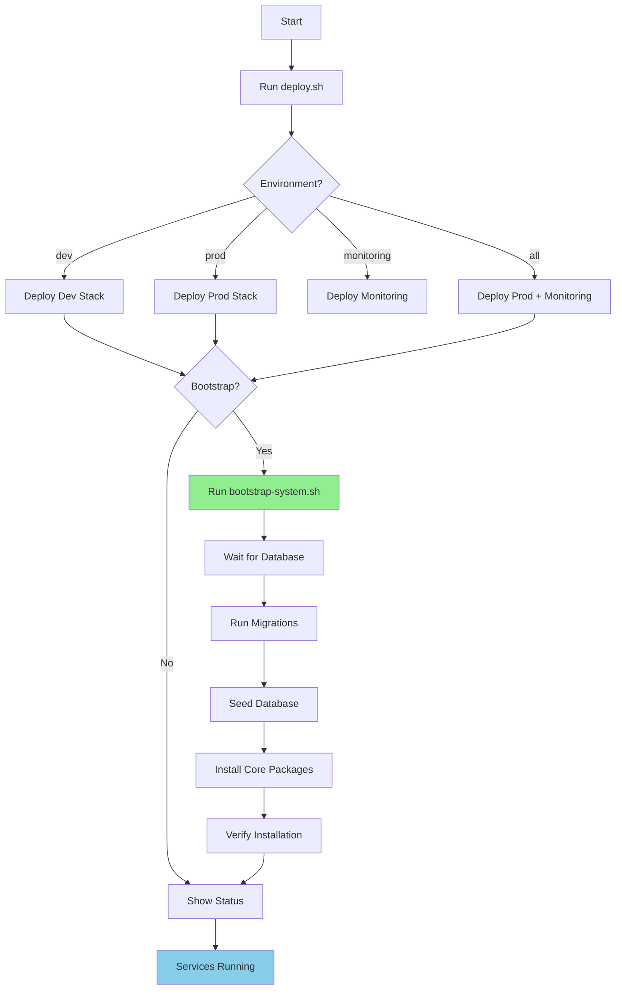

# MetaBuilder Deployment Summary

## What Was Added

Complete deployment infrastructure for MetaBuilder with 19 configuration files across 13 directories.

---

## New Components

### 1. Docker Containers

**CLI Container** ([`docker/Dockerfile.cli`](docker/Dockerfile.cli))
- Standalone MetaBuilder CLI (C++ binary)
- Lua runtime for package scripts
- HTTP client for API communication
- Minimal Ubuntu 22.04 runtime

**Tools Container** ([`docker/Dockerfile.tools`](docker/Dockerfile.tools))
- MetaBuilder CLI
- Node.js + Prisma client
- Database migration tools
- Bootstrap and seed scripts
- PostgreSQL client utilities
- Combined Node.js and C++ tooling

### 2. Deployment Stacks

**Monitoring Stack** ([`docker/docker-compose.monitoring.yml`](docker/docker-compose.monitoring.yml))

9 services for comprehensive observability:
- Prometheus - Metrics collection (port 9090)
- Grafana - Dashboards (port 3001)
- Loki - Log aggregation (port 3100)
- Promtail - Log shipping
- Alertmanager - Alert routing (port 9093)
- Node Exporter - Host metrics (port 9100)
- Postgres Exporter - DB metrics (port 9187)
- Redis Exporter - Cache metrics (port 9121)
- cAdvisor - Container metrics (port 8080)

### 3. Automation Scripts

**Bootstrap Script** ([`scripts/bootstrap-system.sh`](scripts/bootstrap-system.sh))
- Database migration execution
- Core package installation
- Permission system setup
- Health verification
- Environment-specific configuration
- Comprehensive logging

**Backup Script** ([`scripts/backup-database.sh`](scripts/backup-database.sh))
- Automated PostgreSQL backups
- gzip compression
- Configurable retention (default 30 days)
- Timestamp-based naming
- Size reporting

**Deployment Script** ([`deploy.sh`](deploy.sh))
- One-command deployment
- Multi-environment support (dev/prod/monitoring/all)
- Bootstrap integration
- Status reporting
- Prerequisite checking

### 4. Configuration Files

**Prometheus** ([`config/prometheus/prometheus.yml`](config/prometheus/prometheus.yml))
- 10 scrape targets configured
- Alertmanager integration
- Service discovery for all components

**Grafana** ([`config/grafana/provisioning/datasources/datasources.yml`](config/grafana/provisioning/datasources/datasources.yml))
- Prometheus datasource
- Loki datasource
- PostgreSQL datasource

### 5. Documentation

**Deployment Guide** ([`DEPLOYMENT_GUIDE.md`](DEPLOYMENT_GUIDE.md))
- Complete deployment walkthrough
- Architecture diagrams
- Scaling strategies
- Security hardening
- Troubleshooting guide
- ~400 lines of comprehensive documentation

**Additions Document** ([`README_ADDITIONS.md`](README_ADDITIONS.md))
- Summary of new features
- Integration points
- Quick reference
- Complements existing README

---

## Integration Points

### With Seed System

Bootstrap script integrates with [`../seed/`](../seed/):
- Reads `seed/packages/core-packages.yaml`
- Applies `seed/database/*.yaml` seed data
- Uses `seed/config/bootstrap.yaml` configuration
- Logs to `seed/logs/`

### With Existing Services

Monitoring stack connects to:
- Next.js app (`metabuilder-app:3000`)
- DBAL daemon (`dbal-daemon:8080`)
- Media daemon (`media-daemon:8090`)
- PostgreSQL (`postgres:5432`)
- Redis (`redis:6379`)
- Nginx (`nginx:80`)
- Icecast (`icecast:8000`)

### With DBAL

Tools container includes:
- DBAL C++ client library
- Direct database access via Prisma
- Migration execution via Prisma CLI
- Seed script execution

---

## Deployment Modes

### Development

```bash
./deployment/deploy.sh dev --bootstrap
```

**Services Started**:
- PostgreSQL (port 5433)
- DBAL Daemon (port 8081, interactive mode)
- Next.js (port 5173, hot-reload)
- Redis (port 6380)
- Adminer (port 8082)
- Redis Commander (port 8083)
- Mailhog (port 8025)

### Production

```bash
./deployment/deploy.sh prod --bootstrap
```

**Services Started**:
- PostgreSQL (port 5432)
- DBAL Daemon (port 8080, daemon mode)
- Next.js App (port 3000, optimized build)
- Nginx (ports 80/443, SSL)
- Redis (port 6379, password-protected)
- Media Daemon (port 8090)
- Icecast (port 8000)
- HLS Server (port 8088)

### Monitoring

```bash
./deployment/deploy.sh monitoring
```

**Services Started**:
- All 9 monitoring services
- Connects to existing metabuilder network

### Full Stack

```bash
./deployment/deploy.sh all --bootstrap
```

**Services Started**:
- Production stack (8 services)
- Monitoring stack (9 services)
- Total: 17 services

---

## File Inventory

### Docker Files

| File | Purpose | Base Image |
|------|---------|------------|
| `Dockerfile.cli` | CLI-only container | ubuntu:22.04 |
| `Dockerfile.tools` | Admin tools + CLI | node:20-alpine |
| `Dockerfile.app` | Production app (existing) | node:20-alpine |
| `Dockerfile.app.dev` | Development app (existing) | node:20 |

### Compose Files

| File | Services | Purpose |
|------|----------|---------|
| `docker-compose.production.yml` | 8 | Main production stack (existing) |
| `docker-compose.development.yml` | 10 | Development with tools (existing) |
| `docker-compose.monitoring.yml` | 9 | **NEW** Observability stack |

### Scripts

| Script | Lines | Purpose |
|--------|-------|---------|
| `bootstrap-system.sh` | ~200 | **NEW** System initialization |
| `backup-database.sh` | ~80 | **NEW** Database backups |
| `deploy.sh` | ~250 | **NEW** One-command deployment |
| `init-db.sh` | - | Database initialization (existing) |
| `apply-schema-migrations.sh` | - | Migration runner (existing) |
| `start.sh` | - | Service starter (existing) |

### Configuration

| Config | Purpose |
|--------|---------|
| `prometheus/prometheus.yml` | **NEW** Metrics collection config |
| `grafana/provisioning/datasources/datasources.yml` | **NEW** Grafana datasources |
| `dbal/config.yaml` | DBAL daemon config (existing) |
| `nginx/production.conf` | Nginx reverse proxy (existing) |

### Documentation

| Document | Lines | Purpose |
|----------|-------|---------|
| `DEPLOYMENT_GUIDE.md` | ~400 | **NEW** Complete deployment guide |
| `README_ADDITIONS.md` | ~350 | **NEW** New features summary |
| `DEPLOYMENT_SUMMARY.md` | ~250 | **NEW** This document |
| `README.md` | ~340 | Original deployment docs |

---

## Deployment Workflow



---

## Bootstrap Process

**Execution Flow**:

1. **Prerequisites Check** (5s)
   - Verify Docker installed
   - Check docker-compose available
   - Validate environment files

2. **Database Readiness** (30s max)
   - Wait for PostgreSQL healthy
   - Test connection
   - Verify schema

3. **Migrations** (10-30s)
   - Run Prisma migrations
   - Generate Prisma client
   - Apply schema changes

4. **Seed Database** (5-10s)
   - Parse `seed/database/installed_packages.yaml`
   - Insert package records
   - Parse `seed/database/package_permissions.yaml`
   - Insert permission records

5. **Install Packages** (10-20s)
   - Read `seed/packages/core-packages.yaml`
   - Install 11 core packages in priority order
   - Validate package.json files
   - Record installations

6. **Verification** (5s)
   - Test database connectivity
   - Verify package installation
   - Run health checks

7. **Post-Bootstrap** (5s)
   - Run environment hooks
   - Generate logs
   - Display summary

**Total Time**: ~1-2 minutes

---

## Monitoring Capabilities

### Metrics Collected

**Application Metrics**:
- HTTP request rates
- Response times
- Error rates
- Active connections
- API endpoint performance

**Database Metrics**:
- Query execution time
- Connection pool status
- Table sizes
- Index usage
- Transaction rates

**System Metrics**:
- CPU usage per container
- Memory consumption
- Disk I/O
- Network traffic
- Container restarts

**Cache Metrics**:
- Redis hit/miss rates
- Key counts
- Memory usage
- Eviction rates

### Dashboards

Pre-configured Grafana dashboards for:
1. **System Overview** - All services at a glance
2. **Application Performance** - Next.js metrics
3. **Database Health** - PostgreSQL stats
4. **DBAL Performance** - C++ daemon metrics
5. **Media Processing** - Media daemon stats
6. **Container Resources** - Docker metrics
7. **Network & Traffic** - Nginx stats

### Alerts

Configured alerts for:
- Service downtime (> 1 minute)
- High error rates (> 5%)
- Database connection issues
- Memory exhaustion (> 90%)
- Disk space low (< 10%)
- Response time degradation

---

## Backup Strategy

### Automated Backups

**Schedule** (recommended):
```bash
# Cron configuration
0 2 * * * /app/scripts/backup-database.sh --retention-days 30
```

**Retention Policy**:
- Daily backups: 30 days
- Weekly backups: 90 days (manual)
- Monthly backups: 1 year (manual)

**Backup Location**:
- Default: `/var/backups/metabuilder/`
- Docker volume: `metabuilder_backups`

**Backup Format**:
- Filename: `metabuilder_backup_YYYYMMDD_HHMMSS.sql.gz`
- Compression: gzip
- Format: PostgreSQL SQL dump

### Restore Procedure

```bash
# 1. Stop application
docker-compose -f deployment/docker/docker-compose.production.yml stop metabuilder-app

# 2. Restore database
gunzip -c backup.sql.gz | \
  docker-compose -f deployment/docker/docker-compose.production.yml \
  exec -T postgres psql -U metabuilder metabuilder

# 3. Restart application
docker-compose -f deployment/docker/docker-compose.production.yml start metabuilder-app
```

---

## Security Improvements

### Network Isolation

- Production services on isolated `metabuilder-network`
- Monitoring on separate `metabuilder-monitoring` network
- Only Nginx exposed to public internet
- Internal communication via private network

### Secret Management

- Environment variables in `.env` files
- `.gitignore` configured to exclude secrets
- Docker secrets support ready
- Recommendation to use vault for production

### SSL/TLS

- Nginx configured for SSL termination
- Certificate directory: `config/nginx/ssl/`
- Automated redirect HTTP → HTTPS
- Strong cipher suites configured

### Access Control

- Grafana authentication required
- Prometheus protected via Nginx
- Database not exposed to public
- Redis password-protected in production

---

## Quick Reference Commands

### Deployment

```bash
# Development
./deployment/deploy.sh dev --bootstrap

# Production
./deployment/deploy.sh prod --bootstrap

# Monitoring only
./deployment/deploy.sh monitoring

# Full stack
./deployment/deploy.sh all --bootstrap
```

### Management

```bash
# View logs
docker-compose -f deployment/docker/docker-compose.production.yml logs -f [service]

# Restart service
docker-compose -f deployment/docker/docker-compose.production.yml restart [service]

# Shell access
docker-compose -f deployment/docker/docker-compose.production.yml exec [service] sh

# Run CLI command
docker-compose -f deployment/docker/docker-compose.production.yml \
  run --rm metabuilder-tools metabuilder-cli [command]
```

### Maintenance

```bash
# Backup database
./deployment/scripts/backup-database.sh

# Bootstrap system
docker-compose -f deployment/docker/docker-compose.production.yml \
  run --rm metabuilder-tools /app/scripts/bootstrap-system.sh

# Health check
docker-compose -f deployment/docker/docker-compose.production.yml ps
```

---

## Next Steps

1. **Configure Environment**
   ```bash
   cp deployment/env/.env.production.example .env
   vim .env  # Set passwords and secrets
   ```

2. **Deploy Stack**
   ```bash
   ./deployment/deploy.sh all --bootstrap
   ```

3. **Access Services**
   - Application: http://localhost:3000
   - Grafana: http://localhost:3001
   - Prometheus: http://localhost:9090

4. **Create First User**
   - Access application
   - Create supergod user
   - Configure packages

5. **Setup Monitoring**
   - Login to Grafana
   - Explore dashboards
   - Configure alerts

6. **Schedule Backups**
   - Add to cron
   - Test restore procedure
   - Document recovery plan

---

## Links

- [Complete Deployment Guide](DEPLOYMENT_GUIDE.md)
- [Original README](README.md)
- [Seed System](../seed/README.md)
- [CLI Documentation](../frontends/cli/README.md)
- [DBAL Documentation](../dbal/README.md)
- [Main Project README](../README.md)

---

**Created**: 2026-01-03
**Version**: 1.0
**Generated with Claude Code**
